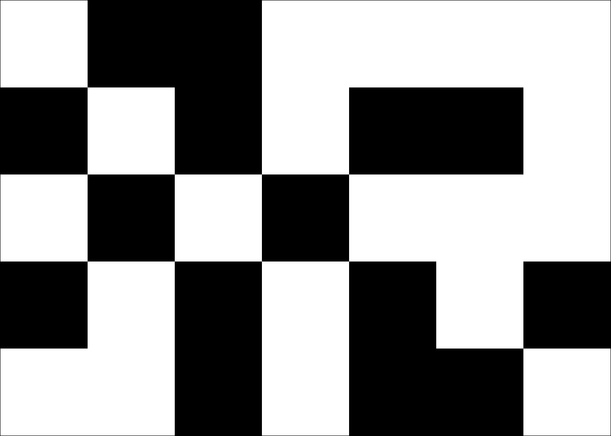

# TATLO!
Turn All The Lights Off! A deceptively simple puzzle game that'll make your brain hurt in the best way.

The goal is simple: make all the cells the same color. Click a cell and it flips along with its neighbors. Sounds easy, right? Try it on a bigger grid with more colors and see how long it takes you.

Play it [here!](https://napero.github.io/TATLO) or on [itch.io](https://napero.itch.io/tatlo-turn-all-the-lights-off)

## How to Play
Click any cell to flip it and its neighbors based on the current pattern (default is a cross shape). With 3+ colors, holding Shift cycles backwards. Any color can be the winning color - just get them all matching.

The timer starts on your first click and tracks every move. Try to beat your personal best for each configuration!

## Controls

### Mouse
- **Left Click** - Flip cell and neighbors (cycles colors forward)
- **Shift + Left Click** - Flip cell and neighbors backwards (3+ colors only)
- **Click & Drag** - When customizing patterns, drag to paint multiple cells at once

### Keyboard Shortcuts
- **R** - New scramble (same seed/config)
- **I** - Change grid size
- **C** - Change number of colors
- **S** - Customize click pattern

### UI Buttons
- **Info** - See this help, plus feature explanations and credits
- **New Scramble** - Generate a new random puzzle
- **Customize** - Opens the full settings menu:
  - Set Grid Size (2×1 up to 50×50)
  - Set Colors (2 to 256)
  - Design Click Pattern (drag to paint!)
  - Reset Everything back to defaults

## Features

### Core Gameplay
- ⏱️ **Precision Timer** - Tracks time down to centiseconds because every millisecond counts
- 📊 **Move Counter** - See exactly how many clicks it took you
- 🏆 **Personal Records** - Your best time, move count, and score saved for each unique setup
- 🎲 **Random Seeds** - Every scramble uses a shareable seed so you can replay or challenge friends
- 🔢 **Seed System** - Enter a seed to play the exact same puzzle, share with others, or retry to improve your score

### Customization
- 🎨 **Grid Sizes** - Anywhere from 2×1 up to 50×50 (good luck with that)
- 🌈 **Color Options** - 2 colors to 256 colors (warning: your brain might explode)
- 🎯 **Custom Patterns** - Click-and-drag to design any flip pattern you can imagine
- 💾 **Auto-Save** - Everything saves automatically to your browser
- 📱 **Responsive** - Plays nicely on any screen size

### Solver & Scoring
- 🤖 **Auto-Solver** - Get hints for next moves or watch it solve the whole puzzle
- ⚡ **Auto-Click** - Watch the solution execute step-by-step (5 clicks/sec)
- 📊 **Difficulty Scoring** - Live score that updates as you tweak settings
- 📈 **Smart Ratings** - 8 difficulty tiers from "Free" (🎁) to "Impossible" (💀)
- 🧠 **Shape Analysis** - Scoring considers pattern complexity, not just size (no cheesing with rectangles!)

### Quality of Life
- 🔄 **Persistent State** - Game saves mid-puzzle if you close the tab
- 🏆 **Leaderboard** - See all your best scores across different configs
- 🎉 **Easter Eggs** - Hidden surprises for... creative configurations
- 🎨 **Pattern Previews** - See what each pattern does before applying it

## Code Structure

### Core Game Logic
- **`constants.js`** - Grid size, colors, flip patterns, helper functions
- **`game-logic.js`** - Matrix generation, scrambling, color cycling, win detection, canvas rendering
- **`timer.js`** - Precision timer, move counter, best score tracking (time/moves/difficulty)
- **`storage.js`** - localStorage persistence, config key generation, save/load best scores
- **`scoring.js`** - Difficulty calculation with shape analysis, normalization, tier ratings

### UI & Interface
- **`main.js`** - Game initialization, event handlers, button/keyboard controls, difficulty display
- **`ui.js`** - Modal system, pattern selector with drag-to-paint, input validation
- **`seed-ui.js`** - Seed display/input/validation, set seed mode, seed sharing
- **`leaderboard-ui.js`** - Best scores table, random/set seed tabs, difficulty display per entry

### Solver
- **`solver.js`** - Gaussian elimination solver, hint system, auto-solve, auto-click visualization

## Technical Details

### How Scoring Works
The difficulty system isn't just grid × colors. It actually analyzes the pattern shape:

- **Grid Size** - Larger grids scale exponentially (grid^1.5)
- **Colors** - More colors scale even faster (colors^1.8)
- **Pattern Complexity** - This is where it gets interesting:
  - **Rectangularity** - Filled rectangles are boring, get penalized
  - **Line Detection** - Patterns with aspect ratio >3:1 (basically lines) lose 60% of their score
  - **Distance Variance** - Spread out patterns are harder, get bonus points
  - **Layeredness** - Patterns with cells in center, middle, and outer zones get bonus points
  - **Grid Span Penalties** - Tiny patterns on huge grids aren't actually harder

Base difficulty: 7×5 grid, 2 colors, cross pattern = exactly 1,000 points (🙂 Normal)

**Difficulty Tiers:**
- 🎁 Free: <1,000
- 😊 Normal: 1,000-1,999
- 😰 Hard: 2,000-4,999
- 😱 Very Hard: 5,000-7,999
- 🤯 Ummmm: 8,000-11,999
- 😨 Horrified: 12,000-19,999
- 💀 Brutal: 20,000-49,999
- ☠️ Impossible: 50,000+

### Best Score System
Each configuration gets its own save slot:
- Format: `{width}x{height}_c{colors}_p{pattern}`
- Example: `7x5_c2_p-1,0|0,-1|0,0|0,1|1,0` (7×5, 2 colors, cross)
- Saved to browser localStorage
- Never expires unless you clear browser data

### Flip Pattern System
Patterns are just relative coordinates from the cell you clicked:
- Default cross: `[(0,0), (-1,0), (1,0), (0,-1), (0,1)]`
- That means: the cell itself, left, right, up, down
- You can make any pattern - diagonals, big crosses, weird shapes, whatever
- The pattern selector has click-and-drag so you can paint patterns easily

### Scrambling Algorithm
The scramble count uses the formula: `gridSize × colors × ln(colors) × (basePatternSize / actualPatternSize)`. 

Every scramble is a random set of moves, and since all moves are reversible, puzzles are always solvable. The seeded RNG means the same seed always produces the same puzzle.

### Auto-Solver
The solver uses Gaussian Elimination with back-substitution over Z/n (modular arithmetic). Each cell's final state depends on which positions you click, and the solver builds a matrix to find the exact sequence of moves needed. It's the same math used to solve "Lights Out" puzzles.

**Performance:**
- Works for any grid size, color count, and flip pattern
- Large grids (>30×30) can take time since it's O(n³) complexity
- The solver uses back-substitution to handle composite moduli (this needs fixing still, sorry)
- All solutions are verified before being returned, so you can trust the result
- Since puzzles are generated by reversible moves, they're always solvable

When you click "Get Hint", it shows you the very next move. Click "Auto-Solve" and it'll play through the entire solution at 5-30 clicks per second (scales with grid size and colors).

## Credits & Help
If you want to understand the math behind solving these puzzles (at least for the 7×5 default version), check out [this solving guide](https://docs.google.com/document/d/e/2PACX-1vQneouQdbkZ96iV2srNMGTnXVfWiv2udaHyaH42FEdILTS3m1OUxKTd7ozuHwPWGi-8a8WlB51sK-QU/pub). Try solving it yourself first though - it's more fun that way! ;D